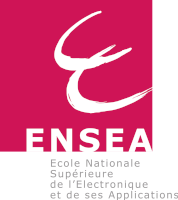
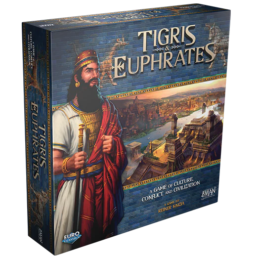

# Projet Logiciel Transversal  
  

**Option Informatique Et Systèmes**  
*3ème année*  
  
  
  
*Bruno MACHADO - Rokhaya SOUMARÉ - Ying ZHOU*  
  
## Table des matières  
  
1. Présentation Générale  
  
   [1.1 Introduction](markdown/1.1.md)  
   [1.2 Règles du jeu](markdown/1.2.md)  
   [1.3 Ressources](markdown/1.3.md)  

2. Description et Conception des États  
  
   [2.1 Description des états](markdown/2.1.md)  
   [2.2 Conception Logiciel](markdown/2.2.md)  
  
3. Rendu: Stratégie et Conception  
  
   [3.1 Stratégie de rendu d’un état](markdown/3.1.md)  
   [3.2 Conception logiciel](markdown/3.2.md)  

4. Moteur de Jeu    
  
   [4.1 Règles de changement d'états](markdown/4.1.md)  
   [4.2 Conception logiciel](markdown/4.2.md)  

5. Intelligence Artificielle    
  
   [5.1 Stratégies](markdown/5.1.md)  
   [5.2 Conception logiciel](markdown/5.2.md)  
  
6. Modularisation    
  
   [6.1 Organisation des modules](markdown/6.1.md)  
   [6.2 Conception logiciel](markdown/6.2.md)  