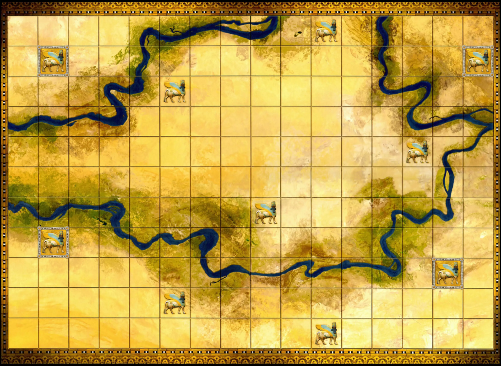
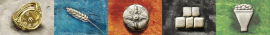
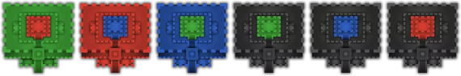

# Ressources

L’image du plateau est illustrée à la figure 1. La figure 2 montre tous les différents types de tuiles et figure 3 les différents types de points de victoire. Les leaders de 4 joueurs différents (un symbole différent pour chaque joueur) sont montrés à la figure 4 et la figure 5 montre tous les monuments possibles.  
 
  
*Figure 1. Image du plateau.*  
  
  
*Figure 2. Image des différents types de tuiles.*  
  
  
*Figure 3. Image des différents types de points de victoire.*  
  
  
*Figure 4. Image des différents types de leaders pour 4 joueurs.*   
  
  
*Figure 5. Image de tous les monuments.*  
  
[Retour à la table des matières](../Rapport.md)