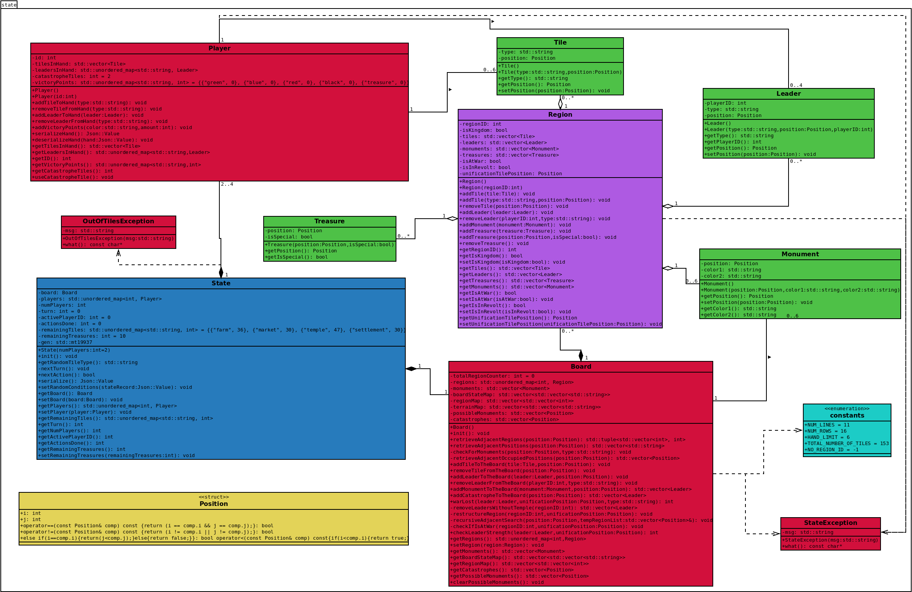

# Conception Logiciel
  
Pour chacun des éléments décrits au chapitre 2.1, nous créerons une classe, à l’exception de la position, qui sera une structure. Tous les attributs et les méthodes de chaque classe sont présentés dans le diagramme de classes, illustré à la figure 6, mais certains détails des classes sont expliqués ci-dessous:  

   * **Classe Player:** L'attribut *id* est utilisé pour distinguer les différents joueurs. Le nombre de trésors qu’un joueur possède est stocké dans un *unordered_map* avec les points de victoire. Puisqu’une fois qu’un joueur reçoit un trésor, il ne peut plus être perdu et il n’est plus affiché sur l'écran, nous supprimons l’objet et incrémentant le nombre de trésors sur le *unordered_map*.  

   * **Classe Board:** Le plateau est composé de plusieurs régions, stockées dans un *unordered_map*. Nous utilisons trois cartes (taille 11 x 16) pour suivre l’état du plateau. Le *regionMap* contient -1 quand il n’y a pas de tuile dans cette position et l’ID de la région correspondante autrement. Le *terrainMap* indique si cette position contient une rivière ou non. Le *boardStateMap* commence comme une copie de *terrainMap*, et garde des traces de tuiles, chefs, monuments et catastrophes quand ils sont ajoutés au plateau. Dans la liste *monuments*, les six monuments possibles sont générés et ajoutés avec des positions négatives (pour indiquer qu’ils ne sont pas construits). Cela se fait parce que ces monuments seront affichés sur l'écran, à la droite du plateau. Lorsqu’un monument est construit, il recevra une position valide et sera ajouté à la région correspondante, en laissant la liste des monuments du plateau.  

   * **Classe Region:** L'attribut *regionID* est utilisé pour distinguer les différentes régions. Il y a quatre vecteurs pour stocker les différents objets, un attribut pour marquer la présence d’un leader dans la région et deux autres attributs pour marquer la présence d’un conflit dans la région. Lorsqu’une guerre est déclenchée, la position de la tuile qui a commencé la guerre est stockée dans l'attribut *unificationTilePosition*, car elle sera nécessaire pour la résolution du conflit.  

   * **Classe Leader:** L'attribut *playerID* est utilisé pour savoir à quel joueur le leader appartient.  

   * **Struct Position:** Quand un objet n’est pas sur le plateau, nous lui attribuons une position négative.  

   * **Classe State:** Notez que cette classe garde également une trace des deux conditions de fin de partie (nombre de trésors restant sur le plateau et nombre de tuiles disponibles pour le tirage).
 

  
  
*Figure 6. Diagramme des classes d’état.*  
  
[Retour à la table des matières](../Rapport.md)