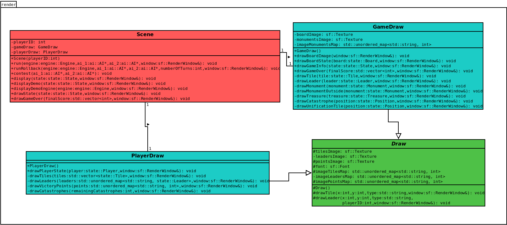

# Conception logiciel
  
  Nous avons créé 4 classes pour effectuer le rendu du jeu:
  
  * **Classe Scene:** C’est la classe de rendu principal. Elle est responsable du rendu de tous les éléments qui seront affichés pour un écran d’un joueur. La méthode principale de cette classe est la display( ), qui est responsable de rendre l’état du jeu passé en argument. Nous avons également créé la méthode displayDemo() afin de tester l’affichage des différents éléments. Lorsque l’utilisateur clique sur l’écran avec le bouton gauche de la souris, la méthode affiche un état différent de jeu. Pour mieux organiser et structurer notre code, nous avons créé les 3 autres classes auxiliaires décrites ci-dessous.  

  * **Classe Draw:** Il s’agit d’une classe abstraite à partir de laquelle les 2 autres classes auxiliaires seront héritées. Nous choisissons de créer cette classe parce que les 2 autres classes partagent certains attributs et méthodes.    

  * **Classe PlayerDraw:** Cette classe est responsable du rendu de tous les éléments qui sont exclusifs pour un joueur. Cela inclut les tuiles et les leaders que le joueur a en main, les catastrophes qu’il a de disponibles et ses points de victoire. Par conséquent, cette classe n’a besoin que d’un objet state::Player pour effectuer sa tâche car cette classe ne nécessite pas d’autres informations sur l’état du jeu. Le contenu d’un objet state::Player n’est connu que par le joueur auquel il est associé, même si les autres joueurs peuvent déduire quels leaders il a en main et combien de catastrophes il lui reste.  
  
  * **Class GameDraw:** Cette classe est responsable du rendu de tout ce qui est commun à tous les joueurs. Cela inclut tous les éléments présents dans le plateau (tuiles, leaders, trésors, monuments, catastrophes et tuiles d’unification (pendant une guerre)), monuments non encore construits et informations générales de jeu (tour actuel, joueur actif, etc). Cette classe est également chargée d’afficher l’image du plateau.  

  Lorsqu’une Scene est construite, elle construit un objet de GameDraw et un objet de PlayerDraw et les enregistre comme attributs de classe. Nous rappelons à nouveau que cette division de classe a été faite avec des fins d’organisation et de lisibilité de code. Le diagramme des classes pour le rendu est présenté en Figure 8.  

    
  *Figure 8. Diagramme des classes de rendu.*  

[Retour à la table des matières](../Rapport.md)