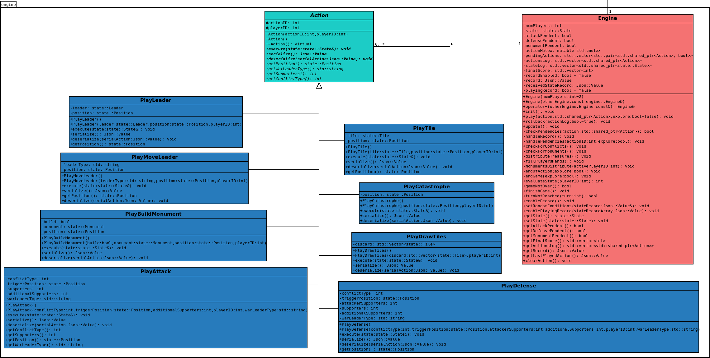

# Conception logiciel
  
  Compte tenu des 8 actions possibles, décrites ci-dessus, qu’un joueur pourrait effectuer pour changer l’état du jeu, nous créons les classes suivantes pour construire notre moteur de jeu:  
  
  * **Classe Engine:** C’est la classe principale qui fera tourner le jeu. Cette classe recevra une action, l'exécutera et appliquera les conséquences possibles de cette action. Cette classe gardera également une trace de tout ce qui s’est passé dans un match. Cette classe sera également responsable d’identifier si l’une des conditions de fin de match a été déclenchée et de définir le gagnant.    
  
  * **Classe Action:** C’est une classe abstraite, à partir de laquelle toutes les actions possibles seront héritées.      
  
  * **Classe PlayTile:** Cette action sera créée quand un joueur veut jouer une tuile sur le plateau.    

  * **Classe PlayLeader:** Cette action sera créée quand un joueur veut jouer un leader de sa main dans le tableau.      

  * **Classe PlayMoveLeader:** Cette action sera créée quand un joueur veut déplacer un leader qui est déjà sur le tableau à une position différente ou de retour à sa main.  

  * **Classe PlayCatastrophe:** Cette action sera créée lorsqu’un joueur veut jouer une tuile catastrophe.  

  * **Classe PlayDrawTiles:** Cette action sera créée quand un joueur veut défausser un certain nombre de tuiles de sa main pour en dessiner de nouvelles.  

  * **Classe PlayBuildMonument:** Cette action sera créée lorsqu’un joueur a la possibilité de construire un monument. Cette action est utilisée pour que le joueur puisse décider s’il veut construire le monument ou non et s’il le veut, quel monument il souhaite construire.  

  * **Classe PlayAttack:** Cette action sera créée juste après qu’un joueur déclenche un conflit. Elle sera utilisée pour définir combien de supporters il veut utiliser.  
  
  * **Classe PlayDefense:** Cette action sera créée pour répondre à une action PlayAttack. Elle sera utilisée pour définir combien de supporters le défenseur veut utiliser et pour résoudre le conflit.    
  
  
  Le rôle de l’IA sera de choisir l’une de ces actions en fonction de l’état du jeu au moment donné. Ils pourront alors créer l’action et la passer au moteur de jeu. Le diagramme de classe pour le moteur de jeu est montré sur la figure 9.    
  
  
    
  *Figure 9. Diagramme des classes de moteur de jeu.*  

[Retour à la table des matières](../Rapport.md)