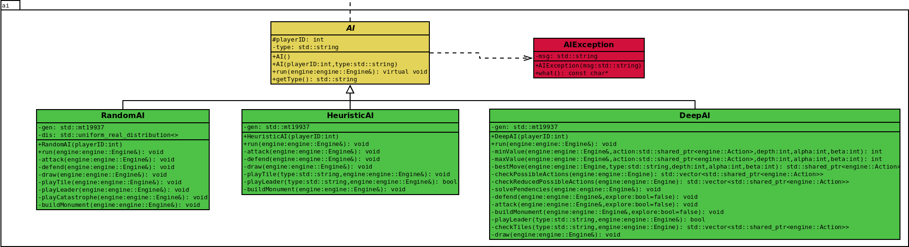

# Conception logiciel
  
  Nous avons créé les classes suivantes pour implémenter l'intelligence artificielle:  
  
  * **Classe AI:** C’est une classe abstraite dont toutes les classes d'intelligence artificielle seront héritées. Chaque AI sera associée à un joueur, par un player ID.    
  
  * **Classe RandomAI:** Implémente la stratégie aléatoire, décrite dans la session 5.1. Les actions sont prises au hasard, avec des probabilités différentes selon le type d’action.        

  * **Classe HeuristicAI:** Implémente la stratégie basée sur des heuristiques, décrite dans la session 5.1. Les leaders et les tuiles sont placés sur le plateau selon la couleur sur laquelle le joueur a le moins de points, obtenant un score final équilibré.  

  * **Classe DeepAI:** Implémente la stratégie avancée, décrite dans la session 5.1. Combinez la stratégie heuristique avec l’algorithme minimax (en utilisant la coupure alpha/beta) pour placer les tuiles dans des positions plus avantageuses.   
  
  
  Le diagramme de classes pour les intelligences artificielles est montré sur la figure 10.    
  
  
    
  *Figure 10. Diagramme des classes d’intelligence artificielle.*  

[Retour à la table des matières](../Rapport.md)