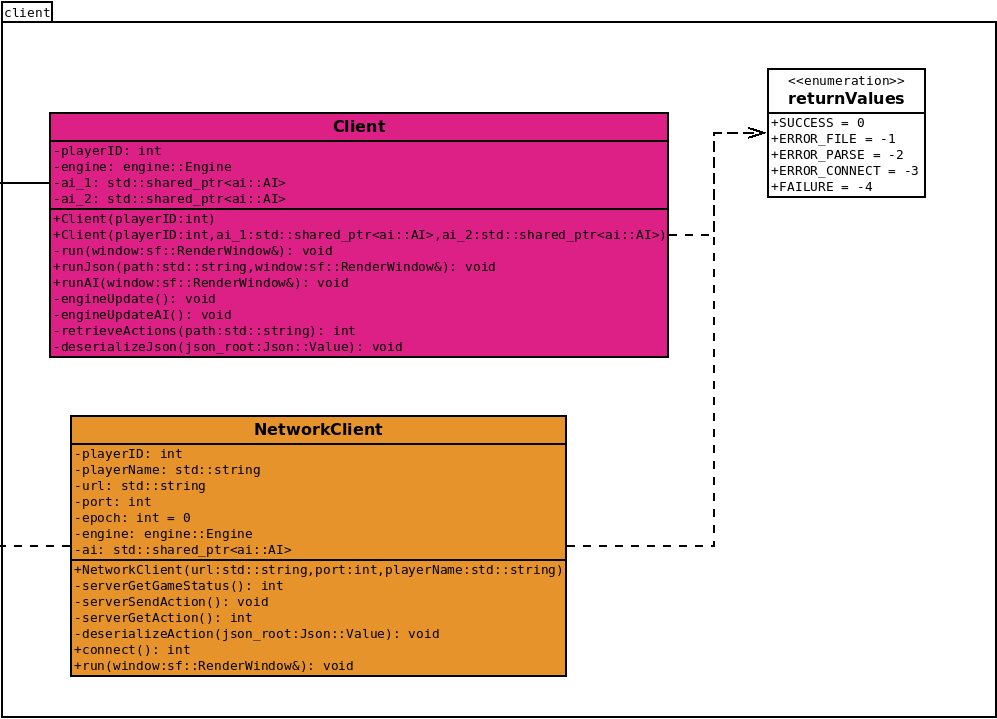
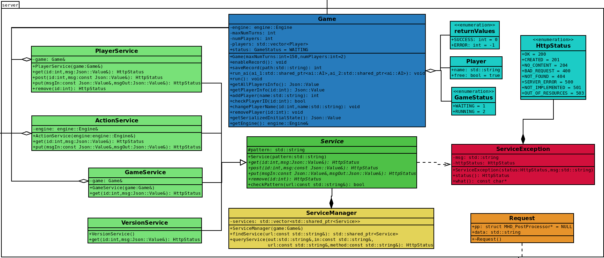

# Conception logiciel  
  
  Cette partie est divisée entre serveur et client. Côté client, nous avons implémenté les classes suivantes:  
  
  * **Classe Client:** Cette classe est responsable de l’exécution du jeu localement. Il contient un moteur de jeu et deux IA. Il permet également d’exécuter un match à partir d’un fichier JSON, implémentant la fonctionnalité de reprise. Il exécute le jeu en utilisant le multithreading, comme décrit dans la section 6.1.  

  * **Classe NetworkClient:** Cette classe permet d’exécuter le jeu sur le réseau. Elle implémente la partie client du processus décrit dans la section 6.1. Elle contient une seule IA qui générera les actions qui seront envoyées au serveur. La classe contient également un moteur de jeu, pour exécuter les commandes reçues par le serveur.   

  Le diagramme de classes pour le client est montré sur la figure 11.  

  Côté serveur, nous avons implémenté les classes suivantes:  

  * **Classe Game:** Cette classe exécute le jeu côté serveur. Elle contient une liste de joueurs connectés et un moteur de jeu pour exécuter les commandes reçues. Cette classe implémente également toutes les méthodes utilisées par les services pour apporter des modifications et récupérer des informations sur le jeu.  

  * **Classe ServiceManager:** Cette classe est utilisée pour gérer tous les services, servant d’intermédiaire entre la bibliothèque microhttpd et chaque service.   

  * **Classe Service:** C’est une classe abstraite à partir de laquelle tous les services sont hérités.  

  * **Classe VersionService:** Implémente le service de version comme décrit dans la section 6.1. Il permet de récupérer la version actuelle de l’API.  

  * **Classe GameService:** Implémente le service de jeu comme décrit dans la section 6.1. Il permet de récupérer le statut du serveur (attente des joueurs ou course).  

  * **Classe PlayerService:** Implémente le service de joueur comme décrit dans la section 6.1. Il permet d’ajouter et de supprimer des joueurs du serveur, permettant aux clients de rejoindre le match. Il permet également de renommer les joueurs et de récupérer tous les noms de joueurs connectés.  

  * **Classe ActionService:** Implémente le service d’action comme décrit dans la section 6.1. Il permet d’échanger des actions entre les clients et le serveur.  

  Le diagramme de classes pour le serveur est montré sur la figure 12.  

    
  *Figure 11. Diagramme des classes de client.*  

    
  *Figure 12. Diagramme des classes de serveur.*  

  
[Retour à la table des matières](../Rapport.md)